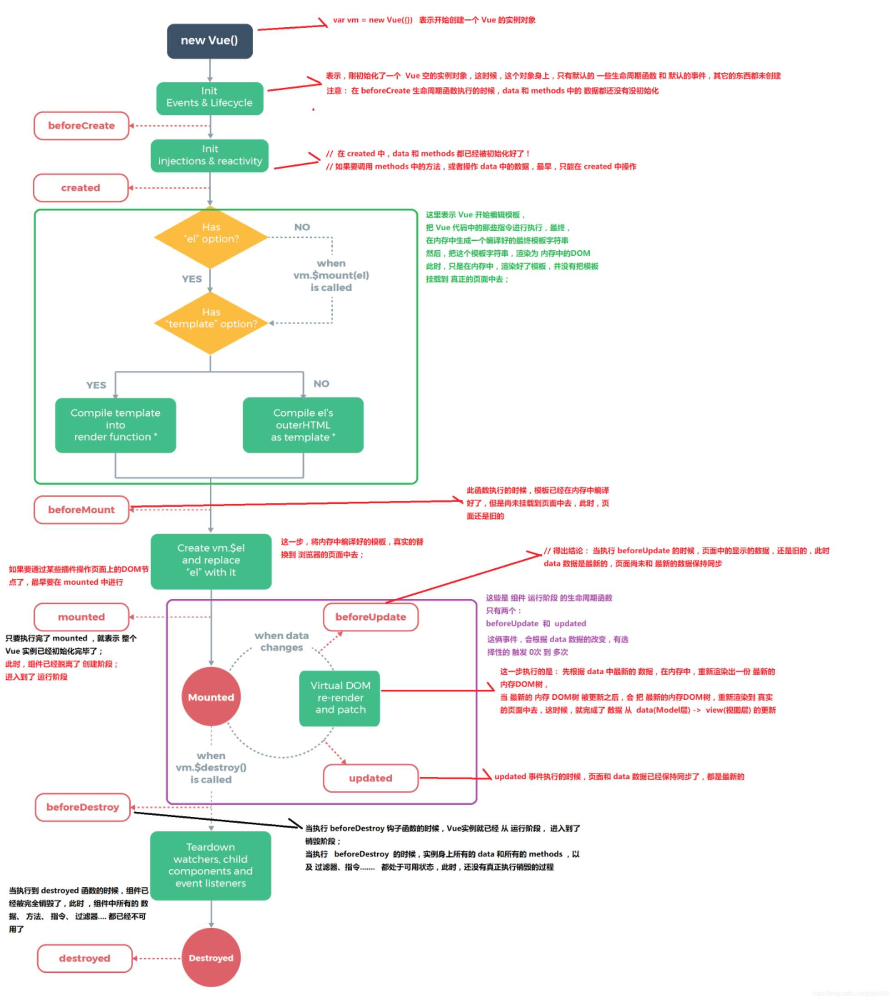

# vue2

## 基础

### vue对象选项

```
let vm = new Vue({
	// DOM
	el:  '#root',
	template: <div></div>,
	render: () => {},
	renderError: () => {},
	// 数据
	data: {},
	props: {},
	methods:{},
	computed:{},
	watch: {}
	// 生命周期钩子
	beforeCreate:()=>{},
	created:()=>{},
	beforeMount:()=>{},
	mounted:()=>{},
	beforeUpdate:()=>{},
	updated:()=>{},
	beforeDestory:()=>{},
	destoryed:()=>{},
	activated:()=>{},
	deactivated:()=>{},
	errorCaptured:()=>{},
	// 资源
	directives: {},
	filters: {},
	components:{},
	// 其他
	name: 'vm',
})
```

#### DOM

##### el

> 如果 `render` 函数和 `template` property 都不存在，挂载 DOM 元素的 HTML 会被提取出来用作模板

- 类型：string | Element

- 限制：只在用new Vue创建实例时生效

- 详细：

  实例挂载点

##### template

> 如果 Vue 选项中包含`render`函数，该模板将被忽略。

- 类型：string

- 详细：

  替换挂载的元素。挂载元素的内容都将被忽略，除非模板的内容有分发插槽。

##### render

- 类型：(createElement: () => VNode) => VNode

##### renderError

> 当 `render` 函数遭遇错误时，提供另外一种渲染输出。

- 类型：(createElement: () => VNode,error: Error) => VNode

#### 数据

##### data

- 类型：Object | Function
- 限制：组件的定义只接受Function

##### props

- 类型：``Array<string>`` | Object

- 详细：props是对象时，可以检查prop类型

  你可以基于对象的语法使用以下选项：

  - `type`：可以是下列原生构造函数中的一种：`String`、`Number`、`Boolean`、`Array`、`Object`、`Date`、`Function`、`Symbol`、任何自定义构造函数、或上述内容组成的数组。会检查一个 prop 是否是给定的类型，否则抛出警告。
  - `default`：`any`
  - `required`：`Boolean`
  - `validator`：`Function`
    自定义验证函数会将该 prop 的值作为唯一的参数代入。在非生产环境下，如果该函数返回一个 falsy 的值 (也就是验证失败)，一个控制台警告将会被抛出。

##### propsData

> 没用过没见过，先空着吧

##### computed

> 计算属性，一般用于多个数据影响一个数据。
>
> 计算属性的结果会被缓存，如果依赖数据不变，再次调用时不会重新计算。
>
> 计算属性的用法和data一样

- 类型：{ [key:string]: Fcuntion | { get : Function, set: Function } }

##### methods

> 方法，需要手动调用
>
> 每次调用都会重新计算

- 类型：{ [key: string]: Function }

##### watch

> 监测，一般用于一个数据影响多个数据
>
> 依赖数据变化时自动调用

- 类型：{ [key: string]: string | Function | Object | Array }  Function 应该是最常用的

#### 生命周期

##### 一般钩子

##### 

##### activated/deactivated

> 被 keep-alive 缓存的组件激活/停用时调用。

##### errorCaptured

> 当捕获一个来自子孙组件的错误时被调用。2.5.0+ 新增

- 类型：`(err: Error, vm: Component, info: string) => ?boolean `

#### 资源

##### components

> 定义Vue实例可用组件

```
import ComponentA from 'xxx'
new Vue({
  ...
  components: {
  	'component-a': ComponentA
  }
})
```

##### directives

[自定义指令](#自定义指令)

> 定义Vue实例可用指令

```
new Vue({
  ...
  directives: {
    focus: {
      // 指令的定义
      inserted: function (el) {
        el.focus()
      }
    }
  }
})
```

##### filters

[过滤器](#过滤器)

> 定义Vue实例可用过滤器

```
new Vue({
  ...
  filters: {
  	capitalize: function (value) {
  		...
  		return ....
  	}
  }
})
```

#### 其他

##### mixins

[混入](#混入 mixin)

> `mixins` 选项接收一个混入对象的数组。

- 类型：``Array<Object>``

```
var mixin = {
  created: function () { console.log(1) }
}
var vm = new Vue({
  created: function () { console.log(2) },
  mixins: [mixin]
})
```

##### name

- 类型：string
- 限制：只有作为组件选项时起作用

### 指令

#### 常用指令

- v-text

- v-html

- v-show

- v-if

- v-else-if

- v-else

- v-for

  必须有唯一的key值，如果数据有插入/删除等影响原有数据顺序的情况，不建议使用index作为key值。

- v-on

  绑定事件

  可以简写为@click的形式

- v-bind

  动态属性

  可以简写为:title的形式

- v-model

  双向绑定

  :value 和 @input 的语法糖

- v-slot

  [插槽](#插槽)

  v-slot: 插槽名，默认为default

  可以简写为#header

  ```
  <!-- 具名插槽 -->
  <base-layout>
    <template v-slot:header>
      Header content
    </template>
  
    Default slot content
  
    <template v-slot:footer>
      Footer content
    </template>
  </base-layout>
  
  <!-- 接收 prop 的具名插槽 -->
  <infinite-scroll>
    <template v-slot:item="slotProps">
      <div class="item">
        {{ slotProps.item.text }}
      </div>
    </template>
  </infinite-scroll>
  
  <!-- 接收 prop 的默认插槽，使用了解构 -->
  <mouse-position v-slot="{ x, y }">
    Mouse position: {{ x }}, {{ y }}
  </mouse-position>
  ```

- v-pre

  跳过这个元素和它的子元素的编译过程。可以用来显示原始 Mustache 标签。跳过大量没有指令的节点会加快编译。

- v-cloak

  这个指令保持在元素上直到关联实例结束编译。和 CSS 规则如 `[v-cloak] { display: none }` 一起用时，这个指令可以隐藏未编译的 Mustache 标签直到实例准备完毕。


- v-once

  只渲染元素和组件**一次**。随后的重新渲染，元素/组件及其所有的子节点将被视为静态内容并跳过。这可以用于优化更新性能。

  **如果确定这个元素及其子组件以后再也不会变动时使用**

#### 自定义指令

##### 钩子函数

- `bind`：只调用一次，指令第一次绑定到元素时调用。在这里可以进行一次性的初始化设置。
- `inserted`：被绑定元素插入父节点时调用 (仅保证父节点存在，但不一定已被插入文档中)。
- `update`：所在组件的 VNode 更新时调用，**但是可能发生在其子 VNode 更新之前**。指令的值可能发生了改变，也可能没有。但是你可以通过比较更新前后的值来忽略不必要的模板更新 

- `componentUpdated`：指令所在组件的 VNode **及其子 VNode** 全部更新后调用。
- `unbind`：只调用一次，指令与元素解绑时调用。

##### 参数说明

- `el`：指令所绑定的元素，可以用来直接操作 DOM。
- `binding`：一个对象，包含以下 property：
  - `name`：指令名，不包括 `v-` 前缀。
  - `value`：指令的绑定值，例如：`v-my-directive="1 + 1"` 中，绑定值为 `2`。
  - `oldValue`：指令绑定的前一个值，仅在 `update` 和 `componentUpdated` 钩子中可用。无论值是否改变都可用。
  - `expression`：字符串形式的指令表达式。例如 `v-my-directive="1 + 1"` 中，表达式为 `"1 + 1"`。
  - `arg`：传给指令的参数，可选。例如 `v-my-directive:foo` 中，参数为 `"foo"`。
  - `modifiers`：一个包含修饰符的对象。例如：`v-my-directive.foo.bar` 中，修饰符对象为 `{ foo: true, bar: true }`。
- `vnode`：Vue 编译生成的虚拟节点。
- `oldVnode`：上一个虚拟节点，仅在 `update` 和 `componentUpdated` 钩子中可用。

> 除了 `el` 之外，其它参数都应该是只读的。

### 插槽

#### 使用

```
// 父组件
<Child>父组件传值</Child>
<Child></Child>
// Child子组件
<div>
	子组件内容...
	<slot>默认内容</slot>
</div>

// 最终显示1
	子组件内容...
	父组件传值
// 最终显示2
	子组件内容...
	默认内容
```

#### 具名插槽

> 用于组件内有多处插槽时，确定内容插入位置

```
// 父组件
<base-layout>
  <template v-slot:header>
    <h1>Here might be a page title</h1>
  </template>

  <p>A paragraph for the main content.</p>
  <p>And another one.</p>

  <template v-slot:footer>
    <p>Here's some contact info</p>
  </template>
</base-layout>

// 子组件
<div class="container">
  <header>
    <slot name="header"></slot>
  </header>
  <main>
    <slot></slot>
  </main>
  <footer>
    <slot name="footer"></slot>
  </footer>
</div>
```

#### 作用域插槽

```
// 父组件获取子组件绑定的属性
// v-slot:default="slotProps"  可以简写为   v-slot="slotProps"  只有default插槽可以这么简写
<current-user>
  <template v-slot:default="slotProps">
    {{ slotProps.user.firstName }}
  </template>
  <template v-slot:deconstruction="{user={firstName: 'hh'}}">
    {{ user.firstName }}
  </template>
</current-user>

// 子组件绑定user属性
<span>
  <slot :user="user">
    {{ user.lastName }}
  </slot>
  <slot :user="user" name='deconstruction'>
    解构插槽Prop
    这里可以用到ES6解构的所有语法，比如重命名、默认赋值
  </slot>
</span>
```

#### 缩写

`v-slot:header="{user}"`

简写为

`#header="{user}"`

**default可以省略**

`v-slot="{user}"`

简写为

`#="{user}"`

#### 废弃的用法

**`slot` 和 `slot-scope`**

```
// 父组件
<div slot='header' slot-scope="slotProps"></div>
```

### 混入 mixin

> 一个混入对象可以包含任意组件选项。当组件使用混入对象时，所有混入对象的选项将被“混合”进入该组件本身的选项。

#### 合并方式

- 数据对象在内部会进行递归合并，并在发生冲突时以组件数据优先
- 值为对象的选项，例如 `methods`、`components` 和 `directives`，将被合并为同一个对象。两个对象键名冲突时，取组件对象的键值对
- 同名钩子函数将合并为一个数组，因此都将被调用。另外，混入对象的钩子将在组件自身钩子**之前**调用

### 过滤器

#### 定义

- 在组件内定义

```
filters: {
  capitalize: function (value) {
    if (!value) return ''
    value = value.toString()
    return value.charAt(0).toUpperCase() + value.slice(1)
  }
}
```

- 全局注册

```
Vue.filter('capitalize', function (value) {
  if (!value) return ''
  value = value.toString()
  return value.charAt(0).toUpperCase() + value.slice(1)
})
```

#### 使用

- 过滤器可以用在两个地方：**双花括号插值和 `v-bind` 表达式**

```
<!-- 在双花括号中 -->
{{ message | capitalize }}

<!-- 在 `v-bind` 中 -->
<div v-bind:id="rawId | formatId"></div>
```

- 串联

```
{{ message | filterA | filterB }}
```

- 接收参数

```
{{ message | filterA('arg1', arg2) }}
```

## 组件

### 动态组件

```
<!-- 组件会在 `currentTabComponent` 改变时改变 -->
<component :is="currentTabComponent"></component>
```

#### keep-alive

```
<keep-alive>
  <component v-bind:is="currentTabComponent"></component>
</keep-alive>
```

**遇到的问题：不需要缓存的组件也被缓存**

解决方案：`include` 和 `exclude`

```
<keep-alive exclude="Detail">
  <component :is="currentTabComponent"></component>
</keep-alive>
```

### 单文件组件

> 文件扩展名为 .vue 的 single-file components (单文件组件) 

- <template></template>包起来，只能有一个根元素

- 导出组件内容

  ```
  <script>
  	module.exports = {
  		name: 'componentA',
  		data: function() {
  			return {}
  		}
  		// 其他配置
  		...
  	}
  </script>
  ```

- 样式

  `scoped`的作用是：使style中定义的样式只在当前组件中生效，避免污染全局样式

  ```
  <style scoped>
  </style>
  ```

  

## 路由

### 关键组件

#### ``router-link``

> ``router-link`` 组件支持用户在具有路由功能的应用中 (点击) 导航。 
>
> 通过 `to` 属性指定目标地址，默认渲染成带有正确链接的 `a` 标签，可以通过配置 `tag` 属性生成别的标签.。
>
> 另外，当目标路由成功激活时，链接元素自动设置一个表示激活的 CSS 类名。

##### to

- 类型：`string | Location`

- required

  > 表示目标路由的链接。当被点击后，内部会立刻把 `to` 的值传到 `router.push()`，所以这个值可以是一个字符串或者是描述目标位置的对象。

##### replace

- 类型: `boolean`

- 默认值: `false`

  > 设置 `replace` 属性的话，当点击时，会调用 `router.replace()` 而不是 `router.push()`，于是导航后不会留下 history 记录。

##### append

- 类型: `boolean`

- 默认值: `false`

  > 设置 `append` 属性后，则在当前 (相对) 路径前添加基路径。例如，我们从 `/a` 导航到一个相对路径 `b`，如果没有配置 `append`，则路径为 `/b`，如果配了，则为 `/a/b`
  >
  > 用到嵌套路由中，就不需要写多层path

##### tag

- 类型: `string`

- 默认值: `"a"`

  有时候想要 ``router-link`` 渲染成某种标签，例如 `li`。 于是我们使用 `tag` prop 类指定何种标签，同样它还是会监听点击，触发导航。

##### active-class

- 类型: `string`

- 默认值: `"router-link-active"`

  > 设置链接激活时使用的 CSS 类名。默认值可以通过路由的构造选项 `linkActiveClass` 来全局配置。

##### exact

> - 类型: `boolean`
>
> - 默认值: `false`
>
>   “是否激活”默认类名的依据是**包含匹配**。 举个例子，如果当前的路径是 `/a` 开头的，那么 ``<router-link to="/a">`` 也会被设置 CSS 类名。
>
>   按照这个规则，每个路由都会激活 ``<router-link to="/">``！想要链接使用“精确匹配模式”，则使用 `exact` 属性

#### router-view

> `router-view`组件是一个 functional 组件，渲染路径匹配到的视图组件。`router-view` 渲染的组件还可以内嵌自己的`router-view` ，根据嵌套路径，渲染嵌套组件。

##### name

> 有时候想同时 (同级) 展示多个视图，而不是嵌套展示，例如创建一个布局，有 `sidebar` (侧导航) 和 `main` (主内容) 两个视图，这个时候命名视图就派上用场了。你可以在界面中拥有多个单独命名的视图，而不是只有一个单独的出口。如果 `router-view` 没有设置名字，那么默认为 `default`

- 类型: `string`

- 默认值: `"default"`

  > 如果 `router-view`设置了名称，则会渲染对应的路由配置中 `components` 下的相应组件

```
<router-view class="view one"></router-view>
<router-view class="view two" name="a"></router-view>
<router-view class="view three" name="b"></router-view>

// config
const router = new VueRouter({
  routes: [
    {
      path: '/',
      components: {
        default: Foo,
        a: Bar,
        b: Baz
      }
    }
  ]
})
```

### router config

#### routes

```
interface RouteConfig = {
  path: string,   // 路由路径
  component?: Component,  //  该路由对应展示的组件
  name?: string, // 命名路由
  components?: { [name: string]: Component }, // 命名视图组件
  redirect?: string | Location | Function,  //  进入该路由时重定向到其他路径
  props?: boolean | Object | Function,
  alias?: string | Array<string>, // 别名：当用户访问 /b 时，URL 会保持为 /b，但是路由匹配则为 /a，就像用户访问 /a 一样。
  children?: Array<RouteConfig>, // 嵌套路由
  beforeEnter?: (to: Route, from: Route, next: Function) => void,
  meta?: any,
  caseSensitive?: boolean, // 匹配规则是否大小写敏感？(默认值：false)
  pathToRegexpOptions?: Object // 编译正则的选项
}
```

#### mode

- 类型: `string`
- 默认值: `"hash" (浏览器环境) | "abstract" (Node.js 环境)`
- 可选值: `"hash" | "history" | "abstract"`

#### base

- 类型: `string`

- 默认值: `"/"`

  应用的基路径。例如，如果整个单页应用服务在 `/app/` 下，然后 `base` 就应该设为 `"/app/"`

#### linkActiveClass

- 类型: `string`

- 默认值: `"router-link-active"`

  全局配置 ``router-link`` 默认的激活的 class。

#### scrollBehavior

[滚动行为](#滚动行为)

- 类型: `Function

#### fallback

- 类型: `boolean`

- 默认值: `true`

  当浏览器不支持 `history.pushState` 控制路由是否应该回退到 `hash` 模式。默认值为 `true`。

### 实例方法

#### 编程式导航

- `router.push(path)`: 跳转到某个路径
- `router.replace(path)`:不产生新的历史记录
- `router.go(num)`:向前进num个路径，如果是负数，就返回num个记录
- `router.back()`:返回上一个记录
- `router.forward()`:向前进一个记录

```
// 字符串
router.push('home')

// 对象
router.push({ path: 'home' })

// 命名的路由
router.push({ name: 'user', params: { userId: '123' }})

// 带查询参数，变成 /register?plan=private
router.push({ path: 'register', query: { plan: 'private' }})
```

#### 导航守卫

#### 其他

### 路由懒加载

### 过渡效果

### 滚动行为

## vuex

## 组件间通信方式

### 父子

1. props和$emit
2. $attrs，$listener

### 跨级

1. 通过父子组件通信方式，层层传递
2. 

### 非嵌套层级关系

#### 兄弟

#### 其他

# vue3