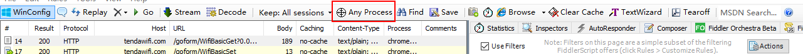

简介

​		测试中，经常需要分析、修改网络请求，此时需要用到抓包工具。目前常用的抓包工具有[Fiddler](http://docs.telerik.com/fiddler/)和[Wireshark](https://www.wireshark.org/)。

​		Fiddler是服务端和客户端间的HTTP代理，能记录两者间的请求。Fiddler功能很强大，在测试中常使用的功能包括：对特定请求及其响应进行分析；设置断点修改请求参数与返回；实现网络限速；设定规则对请求进行mock。

## 为什么使用fiddler?

```
1. Firebug虽然可以抓包，但是对于分析http请求的详细信息，不够强大。模拟http请求的功能也不够，且firebug常常是需要“无刷新修改”，如果刷新了页面，所有的修改都不会保存。
2. Wireshark是通用的抓包工具，但是比较庞大，可以抓取各种请求，而前端测试一般只需要抓取http/https请求。  wireshark能获取HTTP，也能获取HTTPS，但是不能解密HTTPS，所以wireshark看不懂HTTPS中的内容。
3. Fiddler是在windows上运行的程序，专门用来捕获HTTP，HTTPS的。

总结，如果是处理HTTP,HTTPS 还是用Fiddler, 其他协议比如TCP,UDP 就用wireshark
```

# Fiddler使用界面介绍

官方使用文档：https://docs.telerik.com/fiddler/KnowledgeBase/UIGuide


## 左侧表单信息

### 字段

|     列名     |                        含义                        |
| :----------: | :------------------------------------------------: |
|      #       |         抓取的HTTP Request的顺序，从1开始          |
|     Host     |                  请求地址的主机名                  |
|     URL      |                    请求资源地址                    |
| Content-Type |                   请求响应的类型                   |
|    Result    |                     HTTP状态码                     |
|   Protocol   |                   请求使用的协议                   |
|     Body     |                     请求的大小                     |
|   Caching    | 请求的缓存过期时间或者缓存控制值（no-catch之类的） |
|   Process    |              发送此请求的进程：进程ID              |
|   Comments   |        允许用户为此会话添加备注（一般为空）        |
|    Custom    |          允许用户设置自定义值（一般为空）          |

### 图标

|                        图标                         |                 含义                 |
| :-------------------------------------------------: | :----------------------------------: |
|  |              服务端错误              |
|  | 会话被客户端、Fiddler 或者服务端终止 |
|   |               响应成功               |

### 快捷键命令行

通过命令行创建快捷键。

比如点击右侧Inspectors时默认选择查看WebForms。

具体使用操作可以参考：https://www.jianshu.com/p/8089ca3a3ff0

## 右侧请求详情

### Statistics

Statistics关于HTTP请求的性能（例如发送/接受字节数，发送/接收时间，还有粗略统计世界各地访问该服务器所花费的时间）以及数据分析，如下图所示：


### Inspectors

　Inspectors是用于查看会话的内容，上半部分是请求的内容，下半部分是响应的内容，提供headers、textview、hexview,Raw等多种方式查看单条http请求的请求报文的信息，如下图所示：


#### 各项显示内容

|           |                             内容                             |
| :-------: | :----------------------------------------------------------: |
|  Headers  |                         请求/响应头                          |
| TextView  |   请求：set请求传的值    响应：返回文本类数据时，显示内容    |
|  Cookies  | 请求/响应包含了cookie时显示cookie内容，比如登陆页面的响应会生成一个cookie |
| ImageView |                   响应为图片时显示图片信息                   |
|   Auth    |              URL访问是否需要认证（比如访问SVN）              |


### AutoResponder

AutoResponder 可用于拦截某一请求，即按自己添加的指定规则重定向到本地的资源或Fiddler资源，从而代替服务器响应。


### Composer

Composer 自定义请求发送服务器（可以篡改请求响应）

Parsed模式下你只需要提供简单的URLS地址即可。


**可以将左侧列表的请求拖拽到composer中**


Raw


### Filters

​	Filters 即过滤规则，通过设置过滤规则来过滤所需的http请求。

1. Actions`可以选择运行当前过滤集、保存过滤集、导入过滤集。`

2. Hosts `提供根据主机名过滤:不区分/内网/外网`

   ```
   No Hosts Filter 不根据Hosts过滤，此时下方的输入框不能输入
   Hide the following Hosts 隐藏下列Hosts列表
   Show only the following Hosts 只显示下列Hosts列表
   Flag the following Hosts 标记下列主机列表 （被标记的Sessions，会以加粗的形式展示）
   输入框中多个host，可以使用分号分隔，如果输入框的背景是黄色的，说明输入内容有修改且没有保存，可以点击输入框右上角的“Changes not yet saved.”提示，来保存修改
   ```

3. Request Headers `请求头,可以添加或删除HTTP请求头，也可以标识包含特定请求头的请求。`

   ```
   Show only if URL contains 只显示包含某个特殊字符的请求（比如只显示接口请求，这个值设置为goform即可）
   ```


# 手机抓包

**浏览器/APP**

## 配置fiddler

```
1. Tools > Options > Connections
2. 勾选 Allow remote Computers to connect 和 Act as system proxy to startup
3. 设置代理端口（当前默认为8888）
4. 重启fiddler
```

## 配置网络拓扑图

手机和电脑在同一网络下，手机可以访问PC

## 配置手机

```
选择连接的无线信号，进入后看到IP地址等详细信息，然后在最下方HTTP代理设置下配置
填入代理地址：电脑的IP地址
端口：fiddler配置的端口
```

配置完后，可以在fildder上看到手机的请求包（建议关闭PC的浏览器，避免fildder出现PC发送的包）

# 构建模拟测试场景(mock)

## 修改请求/响应参数

```
1.fiddler中选中Rules->Automatic Breakpoints->Before Requests
    页面进行业务操作，此时在fiddler页面可以看见对应的请求图标会有个红色通行标示，表示请求过程中设置了断点，客户端发出的请求被fiddler拦截了
2.修改请求：在左侧点击这个请求，在右侧Inspectors->TextView或WebForms等界面下会看到请求/发送的具体内容，直接修改需要模拟的测试场景数据
3.修改响应：在右下页面的响应tab页中，修改需要模拟的响应测试场景数据
4.点击右下页面的run to complete按钮即可
```

## 模拟响应超时/配置响应时间

```
1. Rules -> Customize Rules
搜索内容 “oSession["response-trickle-delay"]” ，修改一下这里就行了.
2. 勾选Rules -> Performance -> Simulate Modem Speeds 
```

## 模拟各种请求响应

200/404/302等现象可以通过AutoResponder设置，fildder对请求进行劫持，按照设置的

# 抓取指定浏览器的包

点击下图的捕捉按钮，拖动鼠标到指定浏览器，此时浏览器名称及占用端口号将显示在捕捉按钮之后




# 抓取虚拟机的包

本地抓取虚拟机的包

1. 虚拟机——设置——网络——连接方式选择网络地址转换（NAT）
2. 打开虚拟机IE8浏览器的internet选项，选择—连接—局域网设置
3. 代理服务器地址填写本机地址，端口填8888（端口号设置参考[手机抓包](#手机抓包)设置代理端口）

# 前端性能分析及优化

​	使用Statistics页签，用户可以通过选择多个会话来得来这几个会话的总的信息统计，比如多个请求和传输的字节数。

​	选择第一个请求和最后一个请求，可获得整个页面加载所消耗的总体时间。从条形图表中还可以分别出哪些请求耗时最多，从而对页面的访问进行访问速度优化。

​	同时，还可以通过Timeline分析资源加载时序图，可以很直观地看到页面上各个资源加载过程所需要的时间和先后顺序，有利于找出加载过程中比较耗时的文件资源，帮助我们有针对性地进行性能优化。

# 解密https

抓取HTTPS数据包需要手动开启，依次点击：`Tools –> Fiddler Options –>  HTTPS`

## 安装证书

下载并安装[Fiddler证书生成器](https://link.zhihu.com/?target=http%3A//www.telerik.com/docs/default-source/fiddler/addons/fiddlercertmaker.exe%3Fsfvrsn%3D2)

点击Actions,点击第二项：Export Root Certificate to Desktop，这时候桌面上会出现证书FiddlerRoot.cer文件，点击OK设置成功，关闭fiddler


## 导入证书